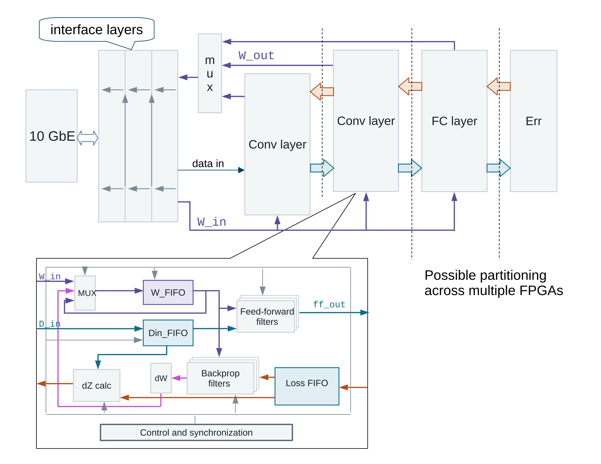

# CNN Training on FPGA

Research prototype exploring the feasibility of training neural networks on multiple FPGAs, with the goal of reducing training time compared with a GPU-based implementation.

The project implements a small convolutional neural network with both **feed-forward** and **backpropagation** computations in FPGA logic. The same network is implemented in pure NumPy and is used as a software reference model for validation.

The current implementation runs on a single FPGA. The architecture, however, is designed so that individual layers or groups of layers can be partitioned across multiple FPGAs and connected through high-speed serial links using FIFO-like streaming interfaces.

## Architecture



The upper part of the diagram shows the complete training datapath.

- Input data and network parameters are transferred through a 10 GbE interface.
- The forward path passes data through convolutional and fully connected layers and calculates the output error.
- The backward path propagates the error through the network and calculates weight updates.
- Weight data is distributed back to the corresponding layers.
- Dashed vertical lines indicate possible partitioning of the network across several FPGAs.

The lower part shows the internal organization of a convolutional layer. Input data and weights are buffered separately, feed-forward and backpropagation filters operate on the streams, and the control logic coordinates data movement, synchronization, gradient calculation, and weight updates.

The architecture is intentionally streaming-oriented. A larger network can therefore be divided between devices without changing the basic layer interface.

## Key Points

- SystemVerilog implementation of CNN training, including forward propagation, backpropagation, and weight updates.
- Pure NumPy reference implementation of the same network.
- FPGA and software implementations use the same weights and adjustable parameters for result comparison.
- Fully pipelined / parallel FPGA datapath.
- 10 GbE UDP control and data-transfer interface.
- Architecture intended for scaling across multiple FPGAs through high-speed transceivers.
- Main RTL was generated from a custom C-like hardware description using an HLS-like transpilation approach.

## Repository Structure

### `classInt16CNN`

Pure NumPy implementation of the reference convolutional neural network.

Run:

```bash
python classInt16CNN_Transfer_00_Base.py
```

Before running the script, extract `mnist_original_archive.zip` into the same directory.

The default configuration trains a small three-layer convolutional network. The number of epochs is controlled by the `EPOCHA` parameter.

Main files:

- `conv_layer.py` — convolutional layer implementation.
- `fully_layer.py` — fully connected layer implementation.
- `classInt16CNN_Transfer_00_Base.py` — reference training scenario.

One epoch takes approximately 15 minutes on the CPU. The network is intentionally small because the NumPy reference model is slow, not because of FPGA resource limitations.

The repository directory structure should be preserved because the FPGA training scripts use weights and configuration data from `classInt16CNN`.

### `cnn_sv`

SystemVerilog sources of the FPGA implementation.

Main files:

- `neural_network_top.sv` — top-level FPGA module.
- `reti_neurali_base_0929.sv` — generated neural-network RTL.

The generated RTL was produced from pseudo-C++ sources using a custom HLS-like approach. It is therefore intended primarily as generated hardware code rather than manually maintained RTL.

The design was developed with Xilinx DSP resources in mind, although the RTL itself does not rely on explicit FPGA primitives.

Relevant top-level signals include:

```systemverilog
input clk;                  // Neural-network clock, must be lower than clk_eth
input clk_eth;              // 10 GbE clock: 312.5 MHz
input i_eth_conf_complete;  // Ethernet interface ready
```

The remaining Ethernet ports implement the 10 GbE RX/TX datapath.

## FPGA Connection

The host communicates with the FPGA through UDP over 10 Gigabit Ethernet.

Current configuration:

- FPGA IP address: `192.168.19.128`
- FPGA MAC address: `33:11:22:00:AA:BB`
- Maximum UDP payload: 8192 bytes
- Jumbo frames must be enabled on the host 10 GbE network adapter.

The host network adapter should therefore be configured in the `192.168.19.x` subnet.

The current FPGA-side protocol implements only the functionality required for the training experiment: ARP responses and training commands. ICMP echo is not implemented.

## FPGA Training Scenario

Run:

```bash
python scenario.py
```

`scenario.py` controls the FPGA training process.

The communication protocol is implemented in `pyGestioneFunzionale.py` by the `classGestioneFunzionale` class. It obtains weights and other adjustable parameters from `classInt16CNN`, allowing the FPGA results to be compared with the NumPy reference implementation.

The current host protocol uses a simple request-response transaction model and does not saturate the FPGA datapath. Consequently, maximum FPGA clock frequency is not required for the supplied demonstration.

## Current Limitations

This repository is a research prototype rather than a production-ready neural-network framework.

- The supplied network is intentionally small.
- The host communication protocol is optimized for simplicity rather than maximum throughput.
- Only the Ethernet protocol functionality required by the experiment is implemented.
- The generated RTL is not intended to be as readable as hand-written SystemVerilog.
- Multi-FPGA partitioning is an architectural target; the repository demonstrates the current single-FPGA implementation.

## License

See [LICENSE](LICENSE).
